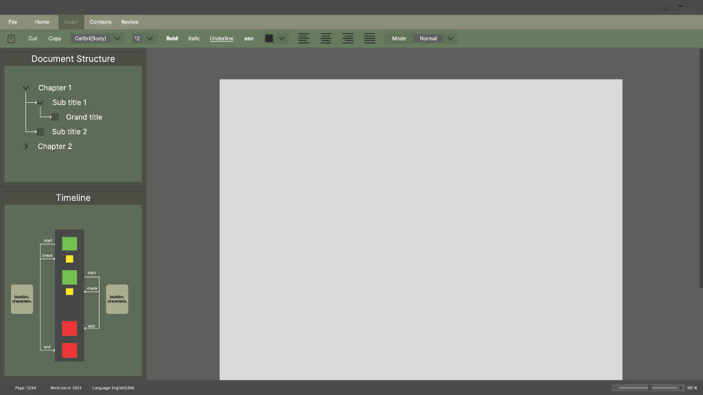

# ToadWriter

<p>
    <p>
        <a href="https://www.rust-lang.org/">
            
        </a>
    </p>
    <p>
        <a href="https://linkedin.com/in/mohammed-rehaan-193305222">
            
        </a>
         <a href="https://github.com/Feohr">
            
        </a>
    </p>
    <p>
        <a href="https://GitHub.com/feohr/toad_writer/commits/">
            
        </a>
         <a href="https://opensource.org/licenses/BSD-3-Clause">
            
        </a>
     </p>
</p>

<p align="center">
    
    
</p>

## Description

A simple text editor that provides a typesetting system that is easy to use. It provides a section
tree representation that helps keep track of different sections in a document. ToadWriter draws
inspiration from various typesetting systems like LaTeX, Markdown and XML.

## Table of Contents
- [Description](#description)
- [Table Of Contents](#table-of-contents)
- [Prototype](#prototype)
- [Installation](#installation)
    - [Manual](#manual)
        - [Rust Installation](#rust-installation)
        - [GTK Installation](#gtk-installation)
            - [GTK On Linux](#gtk-on-linux)
            - [GTK On macOS](#gtk-on-macos)
            - [GTK On Windows](#gtk-on-windows)
        - [Compilation](#compilation)
- [License](#license)
- [Style Guide](#style-guide)
- [Contribution](#contribution)

## Prototype



## Installation

### Manual

To install **Toad Writer** manually you need to compile the repository in your local machine and 
execute the target to run it.
First make sure you have **GTK v4.8** installed in your system as well as **Rust**.

#### Rust installation
Follow the steps to install rust [here](https://www.rust-lang.org/tools/install).

#### GTK Installation

##### GTK On Linux

To check if your linux system already has GTK installed, run the following command on linux:
```console
$ pkg-config --modversion gtk4
```

Or:
```console
$ gtk-launch --version
```

If you do not have GTK installed then please install GTK:

- On Arch/Manjaro and derivatives:
  ```console
  $ sudo pacman -S gtk4 base-devel
  ```

- On Debian/Ubuntu and derivatives:
  ```console
  $ sudo apt install libgtk-4-dev build-essential
  ```

- On Fedora and derivatives:
  ```console
  $ sudo dnf install gtk4-devel gcc
  ```

##### GTK On macOS

Run the following command in your terminal:
```console
$ brew install gtk4
```

##### GTK On Windows

When preparing your Windows machine, you have to decide between either using the MSVC toolchain or 
the GNU toolchain. If in doubt, go for MSVC since that is the default on Windows. You will want to 
go for the GNU toolchain if you depend on libraries that can only be compiled with the GNU toolchain.

- Install:

    - Build GTK 4 with gvsbuild and MSVC (recommended)

    - Build GTK 4 manually with MSVC

    - Install GTK 4 with MSYS2 and the GNU toolchain

#### Compilation

- To compile, open the terminal/command prompt in the root directory of the project and run the 
command:
    ```console
    $ cargo build --release
    ```

- The binary will be present under `/target/release/`. Run as is or add it to your path.

## License

The following project is licensed under BSD 3-clause "New" or "Revised" License.
- [LICENSE](LICENSE.md) or https://spdx.org/licenses/BSD-3-Clause.html

## Style Guide

To learn more about the styling guidelines: [Style Guide](STYLE.md).

### Contribution

Unless you explicitly state otherwise, any contribution submitted for inclusion in the work by you
shall be licensed as above, without any additional terms or conditions.
